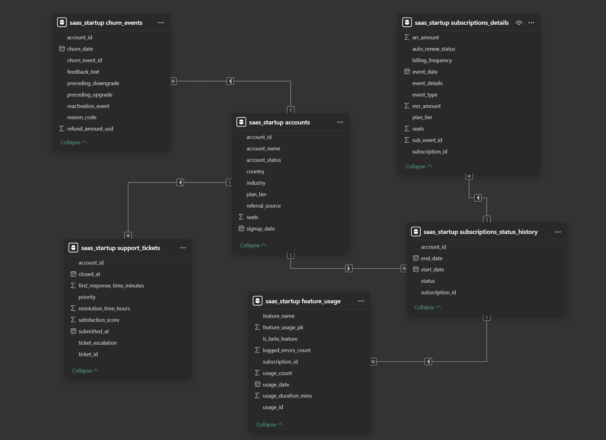

# SaaS Dataset Cleaning & Data Modelling Project

## Project Context

This project originally started as a SQL + Power BI SaaS business analysis using a synthetic dataset downloaded from Kaggle.

However, during the initial data ingestion and modelling phase, I discovered multiple structural inconsistencies in the original dataset that would have negatively impacted the reliability of any downstream BI analysis.

Instead of proceeding directly with dashboards and KPI analysis, I decided to split the work into two separate projects:

1. **This project** → focused entirely on dataset cleaning, restructuring, validation, and relational modelling.
2. **BI Analysis project** → 👉 [SaaS Product Performance Analysis](https://github.com/alessio-pio-zito7-data-analyst/saas-product-usage-retention-analysis/tree/main)

This repository represents the full data remediation and modelling phase required before building a reliable BI solution.

---

## Issues Identified in the Original Dataset

During the ingestion and exploration process, I identified several inconsistencies, including:

- misleading boolean flags
- duplicated identifiers
- mixed business logic
- formatting and NULL issues
- inconsistent relational modelling
- subscription logic stored in non-normalized structures

These issues would have compromised:
- metric consistency
- relational integrity
- KPI reliability
- downstream analytical accuracy

---

## Modelling Example Screenshot

Subscriptions table restructuring process:  
from an inconsistent raw table to a cleaner and more analysis-ready relational model.

---

## What I Did

- Cleaned and restructured the original dataset using Excel
- Redesigned parts of the relational model
- Split inconsistent subscription logic into separate tables
- Improved relational consistency and analytical usability
- Performed data ingestion into MySQL using SQL scripts
- Added:
  - Primary Keys
  - Foreign Keys
  - Constraints
  - Validation checks
- Debugged formatting and hidden NULL-related issues
- Built a complete SQL-based data validation workflow
- Documented the cleaned dataset structure and business logic
- Created a relational data model in Power BI to prepare for future BI analysis

---

## Data Model Schema

Final relational data model created after the cleaning and restructuring process.

---

## Project Structure

Click on the following folders to explore the core components of the project:

- [Data_Modelling](./Data_Modelling)  
  Excel modelling process, formulas, and raw vs cleaned table comparisons.

- [Data_Ingestion](./Data_Ingestion)  
  SQL ingestion scripts and related screenshots.

- [Debugging_&_Data_Validation](./Debugging_%26_Data_Validation)  
  SQL debugging and data validation workflow.

- [Raw_&_Processed_SaaS_Dataset](./Raw_%26_Processed_SaaS_Dataset)  
  Raw and cleaned datasets with related documentation.

---

## Tools Used

- Excel
- MySQL
- Power BI

---

## Goal of the Project

The objective of this project was not to completely reinvent the original dataset, but to:

- preserve the original business logic
- improve structural consistency
- normalize problematic entities
- strengthen relational integrity
- improve analytical reliability
- prepare the dataset for a future BI analysis project

---

## Related Project

**SaaS Product Usage & Retention Analysis**
- Designed KPI framework from business requirements
- Built a Star Schema analytical model in MySQL
- Developed SQL-based KPI calculations and reporting views
- Developed a Power BI dashboard to support product decision-making
  
👉 [View Project](https://github.com/alessio-pio-zito7-data-analyst/saas-product-usage-retention-analysis/tree/main)

